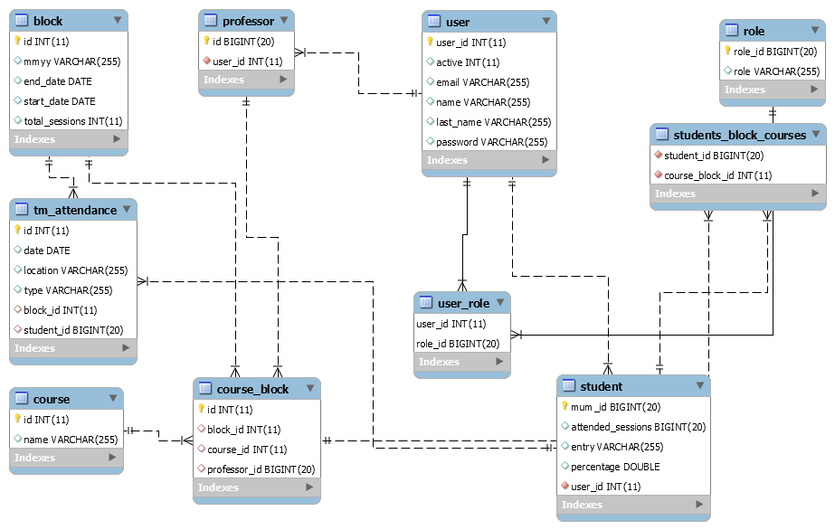

# TM Project - Fast Builders Team
https://github.com/abdelrady/WAA-TM-Project

# Ahmed Elashry Tasks
	TM file upload/processing
	Global error handling redirect page
	System layout/design
# Eman Hassan
	Admin TM report for entries
	Authentication + Authorization
	TM Check CRUD
	Code integration 
# LI Zhang
	TM Retreat CRUD
# Abdelrady Tantawy
	Add project Structure + initial layout
	Add dummy data for testing in data.sql
	Student TM Report 
	Faculty Report
	Logging Aspect (AOP)

# Techniques used

	N-Layer architecture
		* Used across all system
	PRG
		* Used in admin CRUD screens
	MVC
		* Used across all system
	Spring boot
	thymeleaf
		* Used in CRUD screens + all system reports
	REST apis
		* Used in student report
	spring-security
		* Used in controllers to limit access to specific roles
	H2
	Lombok
		* Used in domain models
	hibernate
	aspectj/aop
	bootstrap
	jquery
	css

# ER-Diagram

# Instructions to start

	1- System is configured to work on port 8080
	2- Open solution in intellj, then click RUN
	3- Solution contains data.sql dummy data (courses, blocks, roles, users, professors, students, ... etc)
	4- Users available
		a- Admin: ehassan@mum.edu
		b- Faculty: rxing@mum.edu
		   Faculty: jbreun@mum.edu
		c- Student: atantawy@mum.edu
		d- Password: 123456

